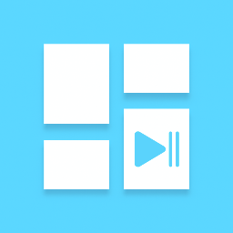

# Wallpanel Media Player

[](https://home-assistant.io)
[](https://github.com/hacs/default)
[![License][license-shield]](LICENSE.md)

[license-shield]: https://img.shields.io/github/license/Riscue/ha-wallpanel-media-player.svg?style=for-the-badge

[](https://github.com/Riscue/ha-wallpanel-media-player/releases)
[](https://github.com/Riscue/ha-wallpanel-media-player/releases)
[](https://github.com/Riscue/ha-wallpanel-media-player/commits/master)

Media Player integration for [https://wallpanel.xyz](https://wallpanel.xyz)



## Installation

### HACS Installation (Recommended)

[](https://my.home-assistant.io/redirect/hacs_repository/?owner=Riscue&repository=ha-wallpanel-media-player)

### Manual Installation

1. Copy the wallpanel_media_player folder to your custom_components folder in your Home Assistant configuration.
2. Add the integration via configuration.yaml
3. Restart Home Assistant.

## Example configuration

```
media_player:
  - platform: wallpanel_media_player
    name: Wallpanel Media Player
    address: http://127.0.0.1:2971
```

## License

MIT © [Riscue](https://github.com/riscue)
